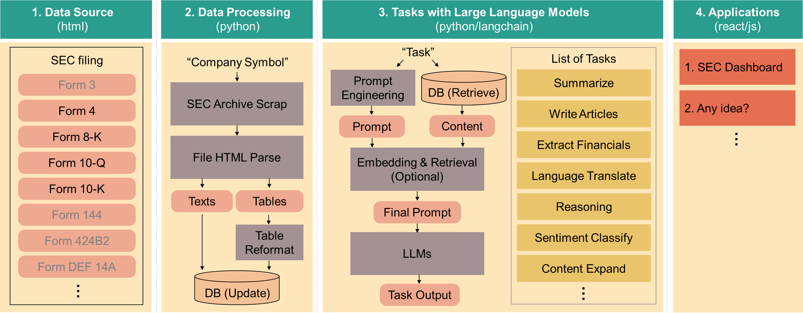

# Welcome to the LLM-based EDGAR Project

## Introduction

Welcome to the LLM-based EDGAR Project, an initiative inspired by the advancements in Large Language Models. 

Our project blends the excellent, globally-released Language Models with the extensive database of SEC EDGAR (Electronic Data Gathering, Analysis, and Retrieval). This endeavor is not about creating new LLMs, but rather, it's about applying the power of these models to revolutionize how financial data is accessed, analyzed, and understood. 

Think of this project as a hobbyist's playground. **This content should not be regarded as financial advice, nor is it a suggestion to engage in real-money trading.**

## Project Overview

The LLM-based EDGAR Project is designed as a multi-faceted endeavor, each facet targeting a aspect of SEC EDGAR data processing and analysis. At its core, this project seeks to:

- **Automate Data Retrieval**: Streamline the process of extracting data from EDGAR, making it more efficient and less labor-intensive.
- **Improve Accessibility**: Make financial data easier to understand and more accessible to a wider audience, including those without a deep background in finance.
- **Enhance Data Analysis**: Utilize the power of LLMs to interpret complex financial reports, extracting valuable insights and trends.

### Overall Diagram



- **Implementation**: The entire pipeline for data processing and Tasks with LLMs are implemented in Python. User interface is implemented in React/Javascript
- **Database Storage**: We utilize CSV/TXT files for simiplicity (without DB manage system)

1. Three environment variables are required
```bash
OPENAI_API_KEY="your_openai_api_key"
MY_CHROMEDRIVER_PATH="/webdriver/path"
SEC_USER_AGENT="company_name your_email@company.com"
```

2. Run python code
```bash
# Collect SEC data published at current date and 2. Perform LLM tasks with updated SEC data 
python run.py --do_data_collection --daysago 0 --do_llm_tasks
```

## Application 1: SEC Dashboard

[View the SEC Dashboard](http://34.125.19.231/)

- **Key Objectives**: Create a REAL-TIME SEC filing monitoring dashboard with automated data retrieval, LLM-based simplification of financial reports, and multilingual support.
- **Features**: Automated data fetching, LLM-driven data simplification, multilingual interface, interactive data visualizations, customizable alerts.
- **Comply with Regulations**: Adheres strictly to the SEC's EDGAR file accessing policies (**Maximum 10 requests per sec**), ensuring responsible and legal data usage. [https://www.sec.gov/os/accessing-edgar-data]

## Application 2: What's Next?

- **Key Objectives**: [List the main goals of this component]
- **Features**: [Describe the main features or functionalities]

## Conclusion

We're excited to embark on this journey and explore the vast potential at the intersection of AI and financial data analysis. Whether you're here to use the tools, contribute to their development, or simply to learn, we welcome your participation and input.
